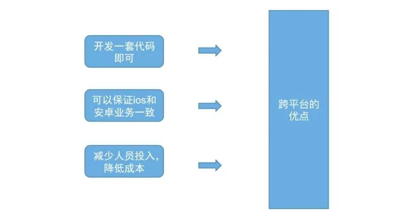
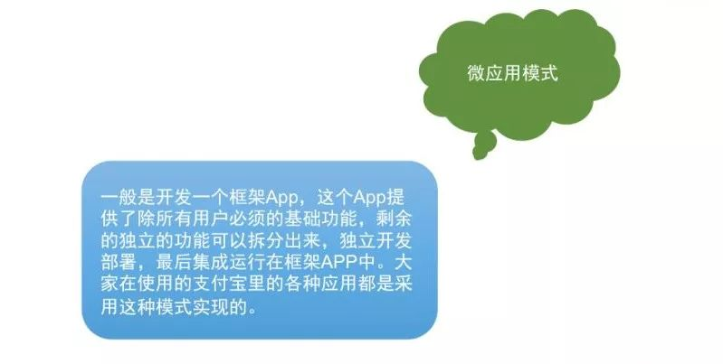
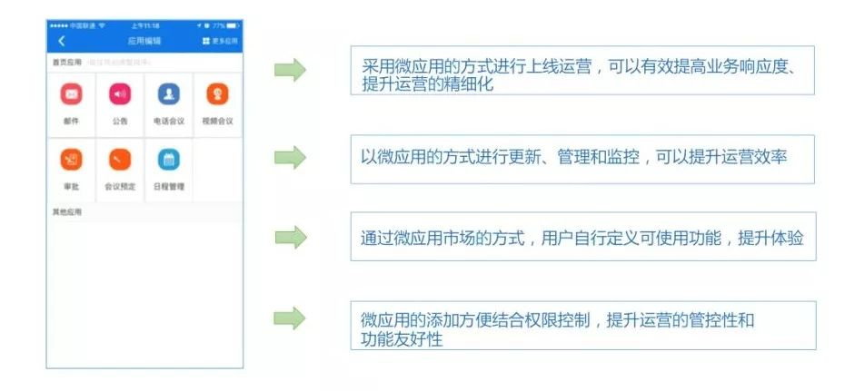
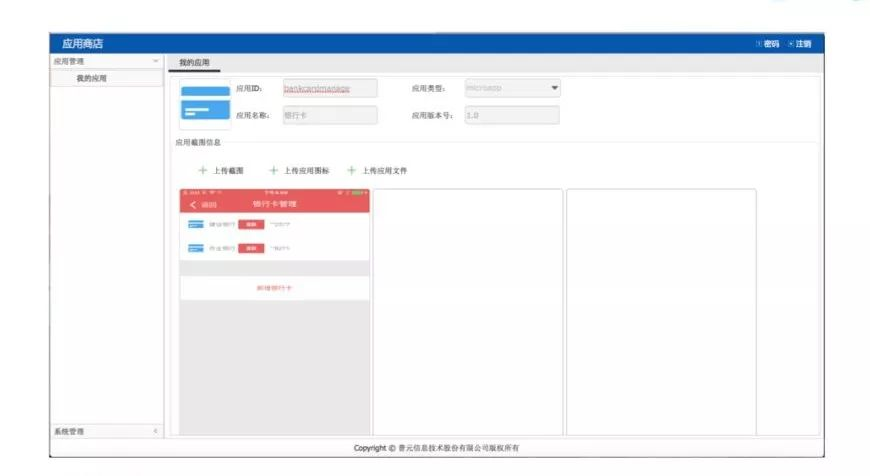
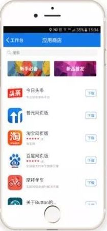
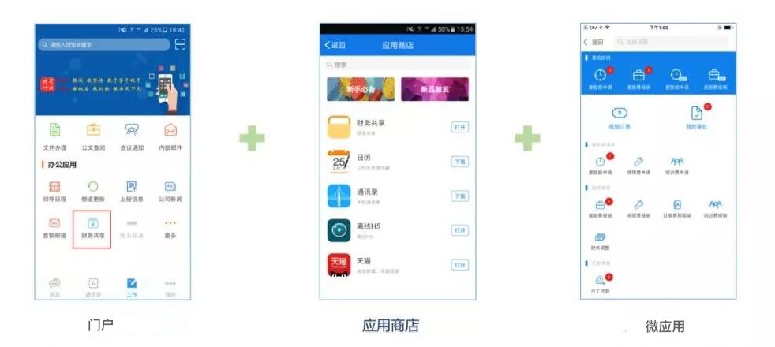
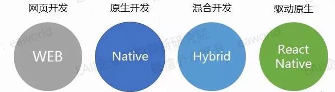
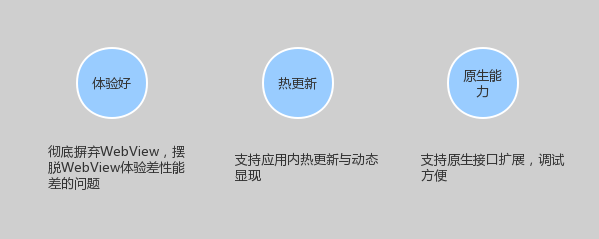
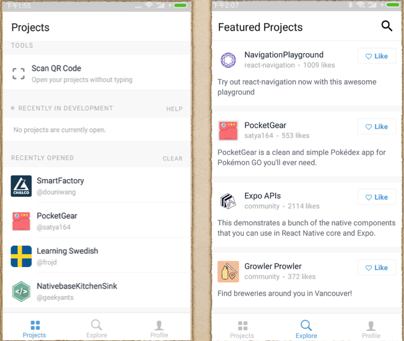

# `RN+微应用+门户` 打造多业务支撑的企业级APP

> APP大型复杂业务的可能性

## 定位 - 应对多业务的高效企业移动平台

### 企业移动化过程中面临的挑战

- 挑战一：多团队开发难以整合，效率低下

- 挑战二：业务复杂多变，需要灵活应对

- 挑战三：各类需求快速移动化，互不干扰

### 针对问题的实践化解决方案

1. 以跨平台的思路解决开发实施问题

    

    跨平台可以保证一套代码适配两个系统，对于开发者来说，就不用像之前一样既写ios代码又写安卓代码，并且也不用去过多的关心系统兼容性问题。

1. 以微应用的模式加速业务推广

    

    简单介绍一下什么是微应用模式？微应用模式，一般是开发一个框架App，这个App提供了除所有用户必须的基础功能，剩余的独立的功能可以拆分出来，分别去开发部署，最后集成运行在框架APP中。大家在使用的支付宝里的各种应用都是采用这种模式实现的。

    - 微应用的三个特点

      

      - 开发的独立性，确保了多个团队能够并行开发且不需要相互依赖，其应用的功能又可以与框架App相互独立，确保其自身功能的自由性
      - 运行态动态部署，开发人员不需要把所有的模块应用都打包发

    - 微应用的优势

      

1. 建设企业应用监管平台

    为了企业运维的人员对应用的统一管理。提出了构建企业内部应用商店的方案，解决企业内部应用的托管和分发问题。

    

    - 微应用统一管理
    - 为了保证对应用的全生命周期管理，应当有健全的审核机制，包括应用创建、灰度、发布、升级、下架全流程审核管理
    - 应用是分权限的，有的应用不是所有人都能使用的，应支持按权限进行管理
    - 支持多种更新机制

      

1. “门户+微应用+企业应用商店” 加快全面移动化

    

    通过门户提供了应用的统一入口，通过商店可以对多类型应用进行管理，这种模式加快了全面移动化的脚步。

## 技术选型 - RN+微应用

### 为什么选择RN作为整合技术

#### App的整合技术是关键，考虑因素

- 用户体验
- 快速开发
- 易于整合

#### 移动端技术比较

1. 网页开发

    用户体验差，本地能力缺失，适配问题大

1. 原生开发

    原生开发的体验好，成本相对来讲高。原生热更方案难以落地

1. 混合开发

    H5作为UI，内置Webkit作为渲染，插件扩展本地能力。

    因其UI的渲染采用浏览器的方式，难免影响用户体验。

1. 驱动开发

    运行态时，调用系统接口，对UI进行渲染，而不是把渲染交给浏览器内核。

    用户体验、跨平台、性能、以及热更方案，可以获得更好的支持。

#### 选择RN的优势

- 优势一：技术先进，用户体验好

    

    > RN缺陷 - 所有业务代码最终都会打包成一个bundle文件：

    - 随着业务的增加，bundle文件越来越大，应用启动和运行速度都会较慢，达不到原来预想的原生体验。
    - 对于多个开发团队，开发的代码耦合性太高，必须打包一起才可以发布，开发维护成本非常高；对于需求的响应会变的缓慢。

- 优势二：RN多bundle模式支撑多团队开发

    拆分多bundle，支撑多团队多业务并行开发：

    1. 将RN基础能力门户 打包成了单独bundle文件，随着apk和ipa一起发布到应用市场。

    1. 业务代码拆分打包成了多个bundle文件，每个bundle文件都可以独立发布。

    1. 应用启动的时候加载badebundle，业务代码做到按需加载。

- 优势三：底层原生，易于整合多应用

### 微应用模式可参考方案 - EXPO

Expo是一个免费的开源工具链，使用JavaScript和React,围绕React Native来帮助你构建原生的iOS和Android项目。

